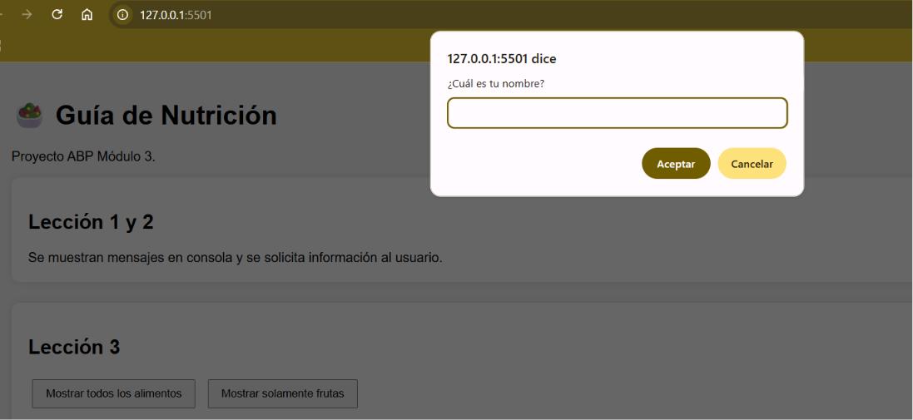
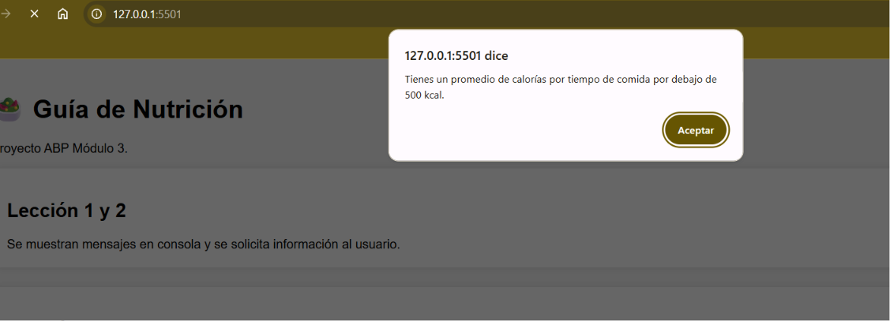
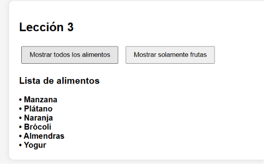

### temática: Guía de Nutrición
   
## Archivos index.html y leccion1.js

En este ejercicio se creó un programa básico en JavaScript que interactúa con el usuario. Primero, se muestra un mensaje de bienvenida en la consola. Luego, mediante la función prompt(), se solicitan tres datos: el nombre del usuario, su fruta favorita y la cantidad de vasos de agua que consume al día.

Posteriormente, la información ingresada se muestra en la consola utilizando console.log(). También se utilizan ventanas emergentes con alert() para entregar mensajes personalizados al usuario con los datos que proporcionó.

imagen detalle:

## Captura de ejecución

## Archivo leccion2.js

## Descripción del proyecto

En este proyecto se desarrolló una calculadora básica de calorías utilizando JavaScript. El programa solicita al usuario ingresar las calorías consumidas en el desayuno y en el almuerzo mediante ventanas emergentes (`prompt`).

Con los datos ingresados se realizan distintas operaciones matemáticas, como calcular el total de calorías consumidas, la diferencia entre ambas comidas, el promedio de calorías y el porcentaje que representan respecto de una meta diaria de 1000 kcal.

Además, se utilizaron estructuras condicionales (`if` y `else`) para informar al usuario si alcanzó la meta diaria de calorías y si su promedio de consumo por comida es superior o inferior a 500 kcal.

Finalmente, se implementó una estructura `switch` que permite seleccionar un tipo de alimento (frutas, verduras o frutos secos) y mostrar información nutricional básica sobre cada uno.

Este ejercicio permitió practicar el uso de variables (`let` y `const`), entrada de datos, operaciones matemáticas, estructuras condicionales y el uso de `switch` en JavaScript.

## Captura de ejecución

## Archivo leccion3.js

## Descripción del proyecto

En esta lección se trabaja con arreglos y ciclos en JavaScript.

Se crea un arreglo llamado listaAlimentos con varios alimentos saludables.
La función mostrarAlimentos() usa un ciclo for para recorrer ese arreglo y mostrar todos los elementos en la página.
La función mostrarFrutas() crea otro arreglo con frutas y usa un ciclo while para recorrerlo y mostrarlas.
También hay una función filtrarAlimentos(textoBuscar) que permite buscar dentro de listaAlimentos los alimentos que contienen el texto ingresado.
Este ejercicio ayuda a aprender:

qué es un arreglo (array),
cómo usar for y while,
y cómo mostrar información en el HTML con document.getElementById().innerHTML.

## Captura de ejecución

## Archivo leccion4.js

## Descripción del proyecto

En esta lecciones se realizan las siguientes funciones:
sumarCalorias(desayuno, almuerzo): suma las calorías de desayuno y almuerzo.
calcularPromedio(desayuno, almuerzo): calcula el promedio de las dos comidas.
calcularPorcentaje(totalCalorias): calcula qué porcentaje representa totalCalorias sobre una meta de 1000 kcal.
calcularNutricion(): toma los valores de los campos #desayuno y #almuerzo, los convierte a número, verifica que sean válidos (no negativos ni NaN), llama a las funciones anteriores y muestra el resultado en #totalCalorias (con un decimal).
Qué se practica: uso de funciones, conversión de tipos (Number()), validación básica, y mostrar resultados en la página con document.getElementById().innerHTML.

## Archivo leccion5.js

## Descripción del proyecto

En este archivo se muestra información de alimentos usando objetos y el DOM.
Qué hace: define un arreglo de objetos con nombre, calorias, categoria y un método descripcion(), carga un selector y botones, permite seleccionar un alimento y ver su detalle, se agregan iconos para mas interactividad
Funciones principales: cargarSelectorAlimentos(), mostrarAlimentos5(), seleccionarAlimento(), mostrarDetalleAlimento(), obtenerNombres().
Qué se practica: objetos y propiedades, métodos dentro de objetos, forEach, find, map, manipulación del DOM (innerHTML), y manejo de eventos simples (click / select).
